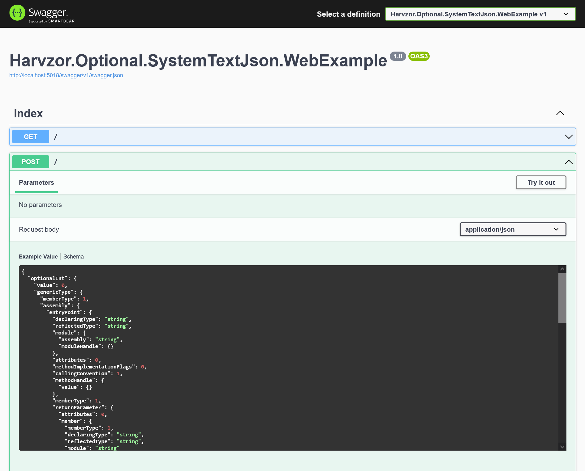
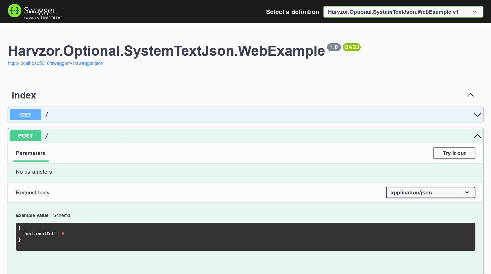

[](https://github.com/harvzor/harvzor-optional/actions/workflows/build.yml)

# Harvzor.Optional

| NuGet Package                   | Version                                                                                                                                     |
|:--------------------------------|:--------------------------------------------------------------------------------------------------------------------------------------------|
| Harvzor.Optional                | [](https://www.nuget.org/packages/Harvzor.Optional/)                               |
| Harvzor.Optional.SystemTextJson | [](https://www.nuget.org/packages/Harvzor.Optional.SystemTextJson/) |
| Harvzor.Optional.NewtonsoftJson | [](https://www.nuget.org/packages/Harvzor.Optional.NewtonsoftJson/) |
| Harvzor.Optional.Swashbuckle    | [](https://www.nuget.org/packages/Harvzor.Optional.Swashbuckle/)       |

## The problem

```csharp
// The JSON would normally come from some external data source:
string json = "{}";

Foo foo = JsonSerializer.Deserialize<Foo>(json);

// This will print an empty string because C# will hydrate the model with the default value.
// There's no way to check if the model used a default value.
Console.WriteLine(foo.MyProperty); // ""    

public class Foo
{
    public string MyProperty { get; set; }
}
```

### So just use a nullable value? (`string?`)

In the above example, you could make the string nullable (with `string?`), but now you're explicitly saying that null is value you want to accept (which you'll have to handle in your code).

What if you want to allow a client to explicitly set null (`"{ "myProperty": null }"`), and want to handle this in your code, while also knowing if the client didn't send *anything*?

## The solution: Optional&lt;T&gt;

### Basic example

You can use `Optional<T>` to know if a property or variable has been explicitly instantiated:

```csharp
using Harvzor.Optional;

Foo foo = new Foo
{
    DefinedProperty = "Bar"
};

Console.WriteLine(foo.DefinedProperty.IsDefined); // True
Console.WriteLine(foo.UndefinedProperty.IsDefined); // False

// Now I can check if a value was explicitly instantiated:
if (foo.DefinedProperty.IsDefined) // True
    Console.WriteLine(foo.DefinedProperty.Value); // "Bar" 
    
if (foo.UndefinedProperty.IsDefined) // False
    Console.WriteLine(foo.UndefinedProperty.Value); // Won't print as the value wasn't explicitly instantiated.

Console.WriteLine(foo.UndefinedProperty.Value); // Will print the default value.

public class Foo
{
    public Optional<string> DefinedProperty { get; set; }
    public Optional<string> UndefinedProperty { get; set; }
}
```

### Use it with JSON

This example uses `System.Text.Json`:

```csharp
using System.Text.Json;
using Harvzor.Optional;

JsonSerializerOptions jsonSerializerOptions = new JsonSerializerOptions();
jsonSerializerOptions.Converters.Add(new Harvzor.Optional.SystemTextJson.OptionalJsonConverter());
jsonSerializerOptions.TypeInfoResolver = new DefaultJsonTypeInfoResolver
{
    Modifiers = { OptionalTypeInfoResolverModifiers.IgnoreUndefinedOptionals }
};

// The JSON would normally come from some external data source:
string json = "{\"DefinedProperty\":\"Bar\"}";

Foo foo = JsonSerializer.Deserialize<Foo>(json, jsonSerializerOptions)!;

Console.WriteLine(foo.DefinedProperty.IsDefined); // True
Console.WriteLine(foo.UndefinedProperty.IsDefined); // False

// Now I can check if a value was defined before I try using it:
if (foo.DefinedProperty.IsDefined) // True
    Console.WriteLine(foo.DefinedProperty.Value); // "Bar" 
    
if (foo.UndefinedProperty.IsDefined) // False
    Console.WriteLine(foo.UndefinedProperty.Value); // Won't print as the value wasn't defined.

public class Foo
{
    public Optional<string> DefinedProperty { get; set; }
    public Optional<string> UndefinedProperty { get; set; }
}
```

### Use in an API

To use it in your controller models, simply register in your startup:

#### Harvzor.Optional.SystemTextJson

```csharp
using Harvzor.Optional.SystemTextJson;

services
    .AddJsonOptions(options =>
    {
        options.JsonSerializerOptions.Converters.Add(new OptionalJsonConverter());
        options.JsonSerializerOptions.TypeInfoResolver = new DefaultJsonTypeInfoResolver
        {
            Modifiers = { OptionalTypeInfoResolverModifiers.IgnoreUndefinedOptionals }
        };
    });
```

#### Harvzor.Optional.NewtonsoftJson

```csharp
using Harvzor.Optional.NewtonsoftJson;

services
    .AddNewtonsoftJson(options =>
    {
        options.SerializerSettings.Converters.Add(new OptionalJsonConverter());
        options.SerializerSettings.ContractResolver = new IgnoreUndefinedOptionalsContractResolver();
    });
```

### Swagger support

#### Harvzor.Optional.Swashbuckle

> **Warning**
> This package is experimental.

Swashbuckle SwaggerGen doesn't know how to handle `Optional<T>` and will attempt to generate complicated objects to express all the properties, for a simple class like:

```csharp
public class Foo
{
    public Optional<int> OptionalInt { get; set; }
}
```

This ends up being generated like:



Instead we want SwaggerGen to treat `Optional<T>` as the generic type `T`. To handle doing this, add this:

```csharp
using Harvzor.Optional.Swashbuckle;

services
    .AddSwaggerGen(options =>
    {
        // The assembly you pass in should include your controllers and perhaps even your DTOs.
        options.FixOptionalMappings(Assembly.GetExecutingAssembly());
    });
```

This results in the correct OpenAPI spec:



This will:

- ensure that all basic types like `Optional<string>` are mapped to the `string` type in the OpenAPI schema
- try to treat complex objects such as `Optional<MyType>` as the underlying generic type `MyType`

This doesn't work in all cases though, for example, with `Optional<Version>`, we want it to be treated as a `string` type and not as a `Version`, so this must be added:

```csharp
using Harvzor.Optional.Swashbuckle;

// Add your custom mappings first:
options.MapType<Optional<Version>>(() => new OpenApiSchema()
{
    Type = "string"
});

options.FixOptionalMappings(Assembly.GetExecutingAssembly());
```

Alternatively, if you don't want to call `FixOptionalMappings(params Assembly[] assemblies)` which automagically finds any references to `Optional<T>` in your assembly, you can just directly feed it `Optional<T>` types that you know are used in your controllers:

```csharp
using Harvzor.Optional.Swashbuckle;

options
    .FixOptionalMappingForType<Optional<Foo>>()
    .FixOptionalMappingForType<Optional<Bar>>()
    .FixOptionalMappingForType<Optional<int>>();
```

##### Known caveats

- `FixOptionalMappings(params Assembly[] assemblies)` does not work with minimal APIs as it searches for `Optional<T>` references on parameters and properties of any classes that implement controller methods, and then maps those `Optional<T>` types to their generic type `T`
- `Optional<T>` doesn't work with query parameters
  - You can't have the following:
    ```csharp
    [HttpGet]
    public string Get([FromQuery] Optional<string> foo)
    {
        return foo;
    }
    ```
  - This is because of the following issue: https://github.com/domaindrivendev/Swashbuckle.AspNetCore/issues/2226

##### Improvements

This package could be improved if these issues are ever resolved:

- https://github.com/domaindrivendev/Swashbuckle.AspNetCore/issues/1810
- https://github.com/domaindrivendev/Swashbuckle.AspNetCore/issues/2359

#### Manual Swagger support

If you're using `Swashbuckle.AspNetCore.SwaggerGen` but don't want to use `Harvzor.Optional.Swashbuckle`, you can also manually tell it how your types should look. Here are some basic types mapped:

```csharp
services.AddSwaggerGen(options =>
{ 
    options.MapType<Optional<string>>(() => new OpenApiSchema
    {
        Type = "string"
    });
    
    options.MapType<Optional<int>>(() => new OpenApiSchema
    {
        Type = "integer",
        Format = "int32"
    });
    
    options.MapType<Optional<float>>(() => new OpenApiSchema
    {
        Type = "number",
        Format = "float"
    });
    
    options.MapType<Optional<double>>(() => new OpenApiSchema
    {
        Type = "number",
        Format = "double"
    });
    
    options.MapType<Optional<bool>>(() => new OpenApiSchema
    {
        Type = "boolean"
    });
    
    options.MapType<Optional<DateTime>>(() => new OpenApiSchema
    {
        Type = "string",
        Format = "date-time"
    });
    
    // IEnumerables:
    options.MapType<Optional<IEnumerable<int>>>(() => new OpenApiSchema
    {
        Type = "array",
        Items = new OpenApiSchema
        {
            Type = "integer",
            Format = "int32"
        }
    });
});
```

You can see what basic types are available here: https://swagger.io/docs/specification/data-models/data-types/

However, handling custom objects such as `Optional<MyObject>` is quite complicated and not recommended, however, here's how to do it anyway:

```csharp
// Rewrite the mapping so it's an object reference:
options.MapType<Optional<MyObject>>(() => new OpenApiSchema
{
    Type = "object",
    Format = format,
    Reference = new OpenApiReference
    {
        Id = nameof(MyObject),
        Type = ReferenceType.Schema,
    }
});

// Now add `MyObject` to the schema repisitory so the mapping actually points somewhere:
options.DocumentFilter<GenerateSchemaFor<MyObject>>();

private class GenerateSchemaFor<T> : IDocumentFilter where T : class
{
    public void Apply(OpenApiDocument swaggerDoc, DocumentFilterContext context)
    {
          context.SchemaGenerator.GenerateSchema(typeof(T), context.SchemaRepository);
    }
}
```

## Use case: JSON Merge PATCH

... need docs ...

## Releasing

### GitLab CI

1. Create a new release with a semver release name

### Manual release

In case the CI doesn't work:

1. Get an API key from https://www.nuget.org/account/apikeys
2.
```
docker-compose build --build-arg version="{version}" push-nuget
docker-compose run --rm push-nuget --api-key {key}
```

## Further reading

- https://stackoverflow.com/questions/63418549/custom-json-serializer-for-optional-property-with-system-text-json
- https://stackoverflow.com/questions/12522000/optionally-serialize-a-property-based-on-its-runtime-value
- Optional in Swagger definition and how to handle generic types: https://github.com/domaindrivendev/Swashbuckle.AspNetCore/issues/2359
  - ISchemaGenerator: https://github.com/domaindrivendev/Swashbuckle.AspNetCore/issues/2333#issuecomment-1035695675
